# El Manejo de Excepciones en Python

## ¿Qué son las excepciones?

Las excepciones en Python son errores que ocurren durante la ejecución de un programa. Estas interrumpen el flujo normal del código si no se manejan correctamente.

El manejo de excepciones permite controlar estos errores y evitar que el programa falle de forma inesperada, proporcionando una mejor experiencia al usuario y facilitando la depuración del código.

---

## Diferencia entre `except`, `else` y `finally`

### `try`
Se utiliza para envolver el código donde puede ocurrir un error.

### `except`
Se ejecuta cuando ocurre una excepción dentro del bloque `try`.  
Permite capturar y manejar el error.

### `else`
Se ejecuta si **NO ocurre ninguna excepción** en el bloque `try`.

### `finally`
Se ejecuta **siempre**, haya ocurrido o no una excepción.  
Se usa comúnmente para liberar recursos o ejecutar acciones finales.

---

## Ejemplos de Ejecución (Capturas)

A continuación se presentan los resultados de ejecución del reto organizados por bloques:

---

### 📂 Bloque 1

  
<b>Click para ver capturas</b>

   

  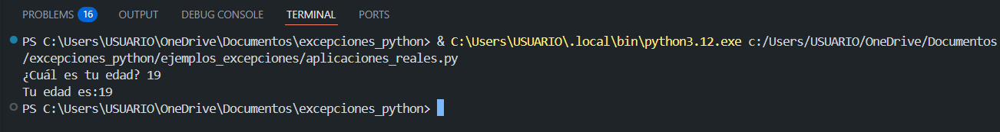
  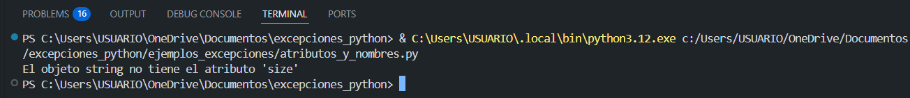
  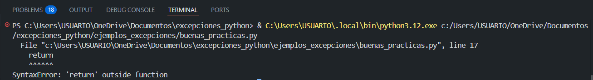
  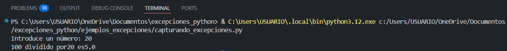
  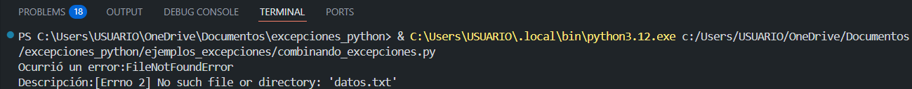
  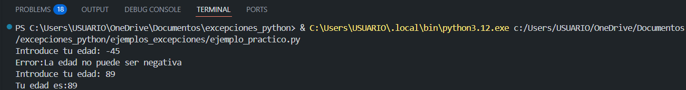
  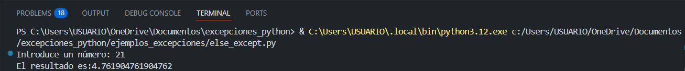
  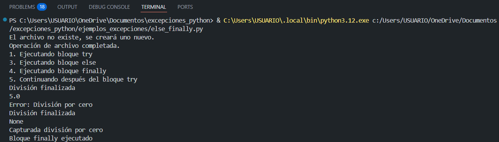
  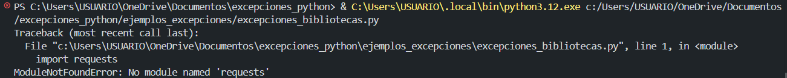

---

### 📂 Bloque 2

  
<b>Click para ver capturas</b>

   

  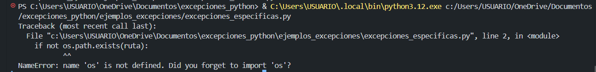
  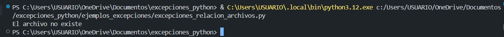
  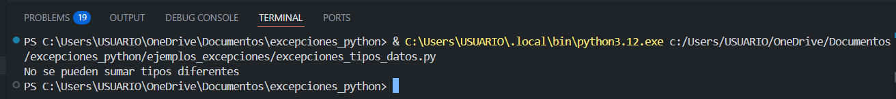
  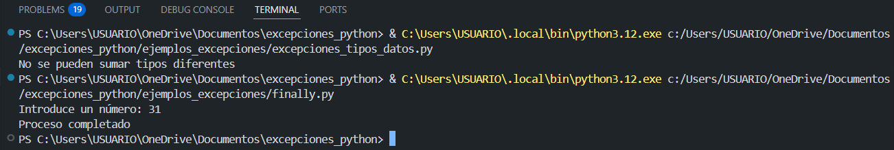
  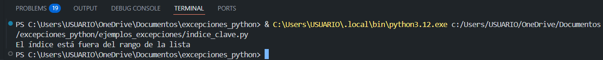
  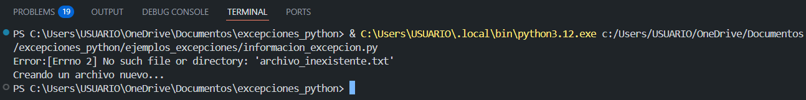
  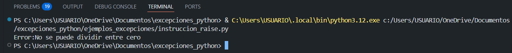
  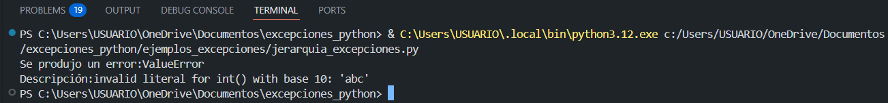
  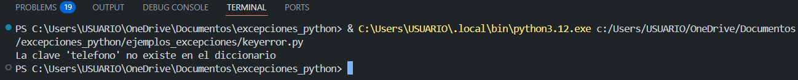

---

### 📂 Bloque 3

  
<b>Click para ver capturas</b>

   

  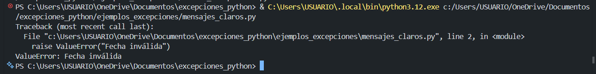
  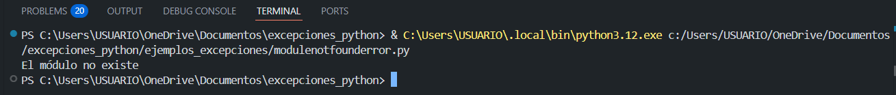
  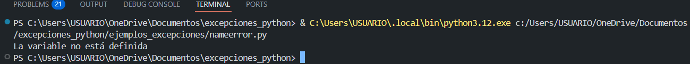
  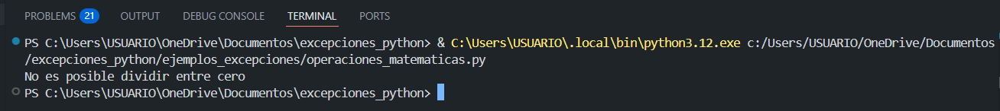
  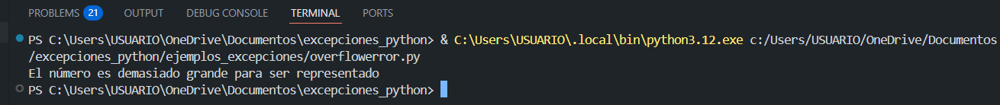
  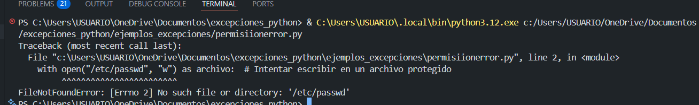
  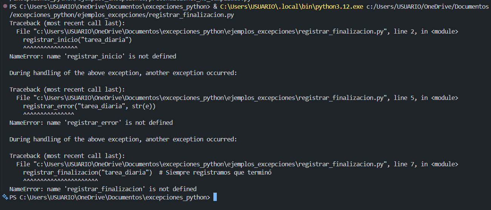
  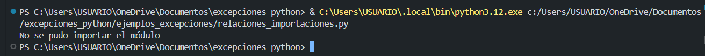
  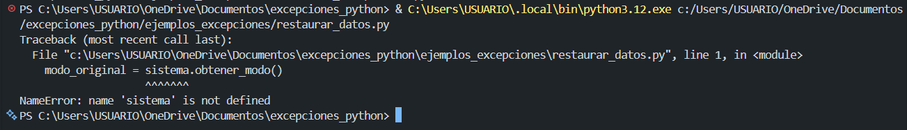

---

### 📂 Bloque 4

  
<b>Click para ver capturas</b>

   

  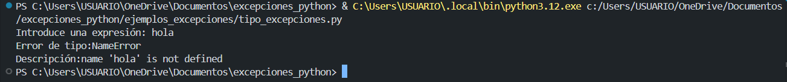
  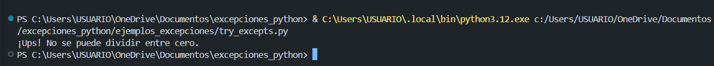
  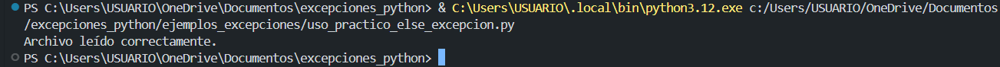
  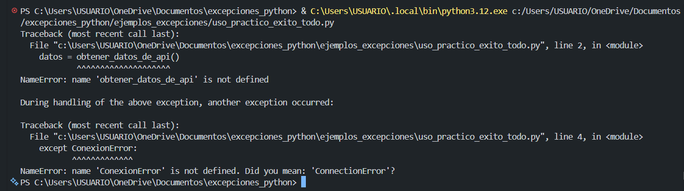
  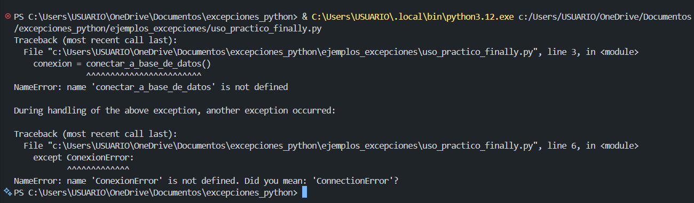
  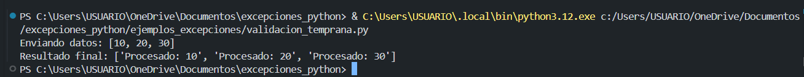
  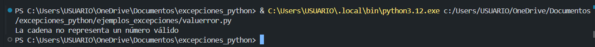
  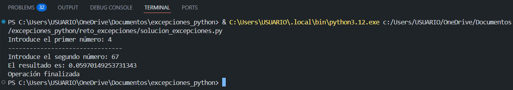
  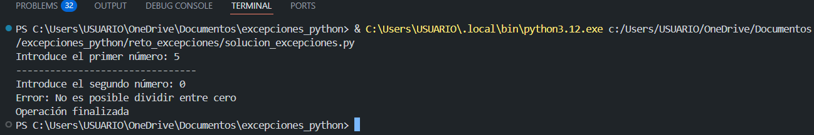

---

## Reflexión personal

El manejo de errores es y será una parte fundamental en el desarrollo de software, ya que permite crear aplicaciones más robustas y confiables.

Durante el reto, se pudo evidenciar cómo la mala gestión de excepciones puede provocar fallos inesperados en el programa. Por el contrario, aplicar correctamente estructuras como `try`, `except`, `else` y `finally` ayuda a controlar el flujo del programa incluso cuando ocurren errores.

Además, aprender a manejar excepciones mejora la experiencia del usuario, ya que en lugar de ver errores técnicos, el sistema puede responder de forma clara y controlada.

En conclusión, el manejo de excepciones no solo es una buena práctica, sino una necesidad para cualquier desarrollador que busque crear software de calidad.